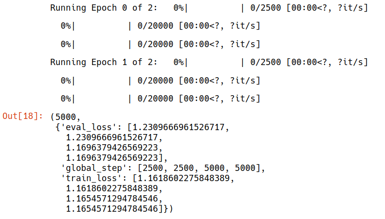

# E2A14P3

**Note: only code changes/major additional codes are shown. For complete code, please see the accompanying notebooks**

## Objectives
The objectives of this assignment was to train the BERT Model for rephrasing questions.

The datasets used are
- Google PAWS-Wiki Labeled (Final)
- Quora Question Pairs Dataset
- Microsoft Research Paraphrase Corpus (MSRP)

However, at the end, 80000/20000 random samples are chosen for train/test.

When two questions are deemed as duplicate (e.g. via the `is_duplicate` column), we can assume that the second question is a rephrase of the first one, and this can be used as training/testing data.

## The BART Model
BART stands for 'Bidirectional and Auto-Regressive Transformer'. Just like the original transformer model, it has both an encoder and decoder, unlike BERT (which only has an encoder) or GPT (which only has a decoder) 

BART achieved better downstream performance on generation tasks, like abstractive summarization and dialogue.

Typical fine-tuning tasks include
- Sequence calssification
- Token classification
- Sequence generation
- Machine translation

### Link to Notebook

## Model
Unlike the original post, this notebook uses the `bart-base` model because the `bart-large` was expected to take 4.5 hours for an epoch. the base model tokk around 45 minutes per epoch. 

## Training Log

## Samples

**Input:** A recording of folk songs done for the Columbia society in 1942 was largely arranged by Pjetër Dungu.  
**Output:** A recording of folk songs done for Columbia society in 1942 was largely arranged by Pjetër Dungu.  

**Input:** In mathematical astronomy, his fame is due to the introduction of the astronomical globe, and his early contributions to understanding the movement of the planets.  
**Output:** His fame is due to the introduction of the astronomical globe and his early contributions to understanding the movement of the planets.  

**Input:** Why are people obsessed with Cara Delevingne?  
**Output:** Why are people so obsessed with Cara Delevingne?   

**Input:** Earl St Vincent was a British ship that was captured in 1803 and became a French trade man.  
**Output:** Earl St Vincent was a British ship captured in 1803 and became a French trade man.  

**Input:** Worcester is a town and county city of Worcestershire in England.  
**Output:** Worcester is a town and county city of Worcestershire in England.
